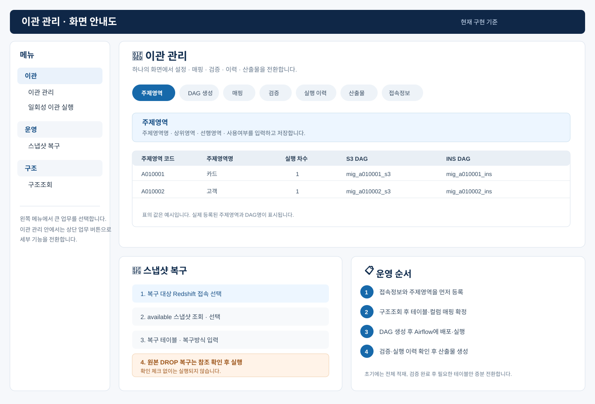

# 이관 관리 운영자 매뉴얼

이 도구는 원천 DB의 데이터를 S3 Parquet 기준본으로 만들고, 검증된 기준본을 대상 DB에 적재하기 위한 이관 전용 메타·DAG 생성·이력·산출물 관리 도구입니다. 실제 DAG 배포와 실행은 Airflow가 담당합니다.

비밀번호·접속문자열·AWS 키는 화면과 메타 테이블에 입력하지 않습니다. PC별 `.streamlit/secrets.toml`과 Airflow Connection에만 관리하며 Git에 올리지 않습니다.

## 1. 기준 구조

```text
원천 접속ID ─┐
             ├─ 테이블·컬럼 매핑 ── S3 Parquet 기준본 ── 대상 접속ID
대상 접속ID ─┘                                │
                                      대상 접속의 S3 기준경로

주제영역 ── DAG 설정 ── S3 / INS / FULL 제어 / INCR 제어 DAG
주제영역 선후행 ───────────────────────────── 프로젝트 오케스트레이터
```

- 접속의 원천·대상 역할은 `TB_MIG_TBL_MPG`의 `SRC_CONN_ID`, `TGT_CONN_ID`가 정합니다. 같은 접속도 매핑에 따라 원천 또는 대상이 될 수 있으므로 접속정보에는 `SRC`, `TGT`, `BOTH`를 저장하지 않습니다.
- S3는 별도 접속이 아닙니다. 대상 접속의 `S3_STG_PATH` 하나를 S3 기준경로로 사용합니다. 따라서 Redshift 대상은 접속정보 한 건만 등록합니다.
- `DBMS_CD`는 접속유형이 아니라 실제 DB 엔진 코드입니다. Greenplum·Redshift는 `psycopg`, Oracle은 `oracledb`, MSSQL은 `pyodbc`를 사용해야 하므로 필요합니다. Greenplum은 PostgreSQL 호환 프로토콜이라 `psycopg` 대상입니다.
- Airflow 접속 ID 입력란은 없습니다. 생성 DAG는 접속정보의 `CONN_ID`와 같은 이름의 Airflow Connection을 사용합니다. S3 자격증명은 Airflow의 공통 `aws_default`를 사용합니다.
- COUNT 검증은 실행 엔진의 공통 필수 규칙입니다. 매핑 화면에는 표시하거나 선택하지 않습니다. SUM·HASH만 컬럼 매핑에서 선택합니다.

## 2. 화면 한눈에 보기



| 메뉴 | 용도 | 사용 시점 |
| --- | --- | --- |
| 이관 초기 설정 | 메타 스키마와 최초 메타 DDL 생성 | 프로젝트 최초 1회 |
| 이관 관리 | 주제영역, DAG 설정·생성, 매핑, 검증, 이력, 산출물, 접속정보 | 일상 운영 |
| 구조조회 | 수동 원천 레이아웃 수집·비교, 대상 반영안·DDL 확인 | 신규 매핑·원천 변경 시 |
| 일회성 이관 실행 | 특정 테이블만 별도 DAG로 재적재 | 장애·보정 시 |
| 스냅샷 복구 | Redshift 테이블 복구와 상태 조회 | 복구 필요 시 |

## 3. 설치와 실행

### 3.1 준비

1. Python 3.12 이상과 Git for Windows를 설치합니다.
2. Python 설치 첫 화면에서 `Add python.exe to PATH`를 선택합니다.
3. PowerShell을 새로 열고 아래 명령으로 확인합니다.

```powershell
py --version
git --version
```

### 3.2 소스와 가상환경

PowerShell에서 한 줄씩 실행합니다.

```powershell
cd $env:USERPROFILE\Documents
git clone https://github.com/lovehamtory/00.StreamlitCode.git
cd .\00.StreamlitCode
py -m venv .venv
.\.venv\Scripts\Activate.ps1
python -m pip install --upgrade pip
python -m pip install -r requirements.txt
```

`스크립트를 실행할 수 없습니다`가 표시되면 현재 창에서만 아래를 실행한 뒤 다시 활성화합니다.

```powershell
Set-ExecutionPolicy -Scope Process -ExecutionPolicy Bypass
.\.venv\Scripts\Activate.ps1
```

| 라이브러리 | 사용처 |
| --- | --- |
| `streamlit`, `pandas` | 관리 화면과 목록 처리 |
| `psycopg[binary]` | Redshift·Greenplum 계열 접속 |
| `oracledb` | Oracle 구조 조회 |
| `pyodbc` | MSSQL 구조 조회 |
| `boto3` | Redshift 스냅샷 복구 API |
| `openpyxl` | 엑셀 산출물 |

### 3.3 Secrets 준비

`.streamlit\secrets.toml`에는 메타 DB 접속, 접속정보에서 참조할 DB 접속 섹션, 스냅샷 복구용 AWS 설정만 둡니다. 실제 값은 문서화하거나 Git에 추가하지 않습니다.

### 3.4 실행

```powershell
python -m streamlit run 10.Gp2Red\app\SrcTgtOrchestrator.py
```

종료는 실행 PowerShell에서 `Ctrl + C`입니다.

## 4. 최초 운영 순서

| 순서 | 화면 | 작업 | 확인 |
| --- | --- | --- | --- |
| 1 | 이관 초기 설정 | DBA가 만든 메타 스키마를 지정하고 `01_mig_metadata_ddl.sql`을 실행 | 메타 테이블·기본 주제영역 생성 |
| 2 | 이관 관리 > 접속정보 | 원천·대상 DB 접속정보와 대상 S3 기준경로 등록 | 사용 접속 목록 확인 |
| 3 | 이관 관리 > 주제영역 | 주제영역명·상위영역·선행영역·사용여부 지정 | 실행 주제영역 활성화 |
| 4 | 구조조회 > 원천 레이아웃 | 필요한 기준일에만 원천 구조 수집 | 테이블·컬럼·PK·NULL 확인 |
| 5 | 이관 관리 > 테이블·컬럼 매핑 | 원천 한글명과 표준화된 대상 영문명·변환식·물리속성 확정 | 매핑 저장 |
| 6 | 구조조회 > 대상 반영안 | 매핑 기준으로 대상 분산·정렬·DDL 확인 | DBA DDL 검토 |
| 7 | 이관 관리 > DAG 생성 | 주제영역 DAG 설정 후 Python 생성 | `10.Gp2Red\dag`에 파일 생성 |
| 8 | Airflow | 생성 파일 배포, Connection 등록, DAG 실행 | Airflow와 실행 이력 확인 |
| 9 | 이관 관리 > 검증 | 원천/S3, S3/대상 검증 결과 확인 | 성공 또는 보정 대상 식별 |
| 10 | 이관 관리 > 산출물 | 정의서·테스트 결과·검증 결과 생성 | 엑셀 파일 확인 |

## 5. 화면별 사용 방법과 코드값

### 5.1 이관 관리 > 접속정보

접속정보는 DB 한 건과 그 DB가 대상일 때의 S3 기준경로를 함께 관리합니다. 테이블 매핑에는 원천·대상 접속 ID만 저장합니다.

| 화면 항목 | 허용값 | 의미 |
| --- | --- | --- |
| 접속 ID | 영문 시작 영문·숫자·밑줄 | Airflow Connection 이름도 같은 값으로 등록 |
| 접속명 | 자유 입력 | 화면 표시명 |
| DBMS | `GREENPLUM`, `REDSHIFT`, `ORACLE`, `MSSQL`, `POSTGRESQL`, `OTHER` | 실제 접속 엔진 |
| 문자길이배수 | `1`, `2`, `3`, `4` | 원천 문자형 자동 변환 시 VARCHAR 길이 배수 |
| S3 기준경로 | `s3://버킷/경로` 또는 공란 | 대상 접속에만 입력, 모든 매핑이 해당 접속을 선택하면 공통 사용 |
| Secrets 섹션명 | PC별 Secrets 섹션명 | 실제 접속값 참조 |
| 사용 | 사용 / 미사용 | 미사용 접속은 신규 매핑에서 선택 불가 |

예를 들어 `SRC_GP`와 `TGT_RED` 두 건이면 충분합니다. `TGT_RED`의 S3 기준경로가 `s3://bucket/migration`이면 S3 파일은 그 하위의 프로젝트·주제영역·테이블 경로에 생성됩니다.

### 5.2 이관 관리 > 주제영역

주제영역은 분류와 오케스트레이션 순서를 분리합니다. 상위 주제영역은 분류이고, 실행 순서는 실행 주제영역 간 선후행으로 지정합니다.

| 화면 항목 | 허용값 | 의미 |
| --- | --- | --- |
| 주제영역 코드 | 상위 `A01`~`Z01`, 하위 `A010001`~`A010010` | 식별 코드 |
| 주제영역명 | 자유 입력 | 업무명은 추후 입력 가능 |
| 상위 주제영역 코드 | 상위 코드 | 하위 실행영역의 분류 |
| 선행 주제영역 | 사용 중인 하위 주제영역 복수 선택 | 프로젝트 오케스트레이터의 선후행 |
| 표시 순서 | 0 이상 정수 | 화면 정렬용, 실행순서 아님 |
| 사용 | 사용 / 미사용 | 미사용 영역은 DAG 생성·프로젝트 실행에서 제외 |

주제영역 선후행은 다대다입니다. 예를 들어 `A010003`에 `A010001`, `A010002`를 선택하면 두 영역이 끝난 뒤 `A010003`이 호출됩니다. 선행 DAG 실패 여부와 무관하게 후행을 호출하도록 생성하며, 최종 집계에 실패가 남습니다. 순환 관계는 저장할 수 없습니다.

### 5.3 이관 관리 > DAG 생성

주제영역 화면에는 병렬도나 일정이 없습니다. DAG 실행 제어값은 이 화면에서만 관리합니다.

| 화면 항목 | 허용값 | 의미 |
| --- | --- | --- |
| S3 기본/최대 병렬 | 1 이상 정수, 최대 ≥ 기본 | S3 테이블 작업의 기본 동시 실행 수와 DAG 상한 |
| INS 기본/최대 병렬 | 1 이상 정수, 최대 ≥ 기본 | 대상 적재 작업의 기본 동시 실행 수와 DAG 상한 |
| 증분 S3 일정 | `NONE`, `DLY_0100`~`DLY_0500` | 해당 주제영역 `INCR_CTL`의 Airflow 일정 |

| 생성 DAG | 역할 |
| --- | --- |
| `mig_{주제영역}_s3` | 원천 → S3 Parquet·매니페스트 |
| `mig_{주제영역}_ins` | 검증 성공 S3 기준본 → 대상 적재 |
| `mig_{주제영역}_full_ctl` | S3 → 원천/S3 검증 → INS → S3/대상 검증 |
| `mig_{주제영역}_incr_ctl` | 증분 대상만 S3 → 원천/S3 검증 |
| `mig_{프로젝트}_full_orch` | 주제영역 선후행 기준 전체 제어 DAG 호출 |
| `mig_{프로젝트}_incr_orch` | 주제영역 선후행 기준 증분 제어 DAG 호출 |

| 실행 모드 | 흐름 |
| --- | --- |
| `S3_INS` | S3 → 원천/S3 검증 → INS → S3/대상 검증 |
| `S3_ONLY` | S3 → 원천/S3 검증 |
| `INS_ONLY` | 검증 성공 S3 기준본 → INS → S3/대상 검증 |

### 5.4 구조조회

구조조회는 매일 실행하는 배치가 아닙니다. 신규 매핑, 원천 레이아웃 변경, DDL 검토가 필요할 때 수동으로 사용합니다.

| 화면 | 입력 | 결과 |
| --- | --- | --- |
| 원천 레이아웃 | 접속, 기준일, 스키마 | 원천 테이블·컬럼·PK·NULL·순번 |
| 기준일 비교 | 이전 기준일, 현재 기준일 | 신규·변경·삭제 후보 |
| 대상 반영안 | 저장된 테이블·컬럼 매핑 | 대상 분산키·정렬키·DDL 미리보기 |

원천 테이블·컬럼이 한글이고 대상 Redshift가 표준 영문명인 경우에도 테이블·컬럼 매핑의 원천명·대상명을 각각 유지합니다. `TRNSF_EXPR`에 변환 SQL을 넣으면 적재 SQL에 반영됩니다.

### 5.5 이관 관리 > 테이블·컬럼 매핑

테이블과 컬럼은 한 화면에서 함께 등록·수정합니다. 일괄 업로드도 테이블매핑·컬럼매핑 두 시트를 한 파일로 입력합니다.

| 테이블 항목 | 허용값 | 의미 |
| --- | --- | --- |
| 적재 상태 | `FULL`, `INCR` | 초기·전체 대상 또는 일 증분 대상 |
| 증분 기준 | 공란, `DT`, `YMD`, `YM`, `WM_DTM`, `PK` | 증분 범위 판단 기준 |
| 증분 기준 컬럼 | 원천 컬럼명 | 일자·일시·PK 등 범위 컬럼 |
| S3 병렬 방식 | `NONE`, `WHERE` | 전체 추출 또는 조건 배열별 S3 병렬 추출 |
| S3 병렬 조건 | `WHERE`일 때 JSON 배열 | 조건 하나가 S3 추출 작업 하나 |
| 대상 분산 방식 | `AUTO`, `EVEN`, `KEY`, `ALL` | Redshift 분산 설정 |
| 대상 정렬 방식 | `AUTO`, `NONE`, `COMPOUND`, `INTERLEAVED` | Redshift 정렬 설정 |

| 컬럼 항목 | 값 | 의미 |
| --- | --- | --- |
| 원천/대상 컬럼명, 순번, 타입, NULL, PK | 컬럼별 입력 | 원천과 표준화 대상의 차이를 보존 |
| 변환 SQL식 | 선택 입력 | 대상 컬럼 생성식 |
| 기본값 SQL식 | 선택 입력 | 대상 컬럼 기본값 |
| SUM 검증 여부 | 사용 / 미사용 | 선택 컬럼 합계 검증 |
| HASH 검증 여부 | 사용 / 미사용 | 선택 컬럼 해시 검증 |

`S3 병렬 조건`은 테이블 단위 설정입니다. 예시는 아래와 같습니다.

```text
["abc_dt BETWEEN '19000101' AND '20001231'", "abc_dt BETWEEN '20010101' AND '20101231'"]
```

`REBASE`와 별도 `원천 S3 적재 방식`은 사용하지 않습니다. 일회성 재적재도 기존 `FULL`·`INCR` 상태를 바꾸지 않습니다.

### 5.6 일회성 이관 실행

장애 보정·구조 변경·검증 불일치 시 특정 테이블만 별도 DAG로 생성합니다. 별도 관리 테이블은 만들지 않고 기존 실행로그·검증 결과에 기록합니다.

| 화면 항목 | 허용값 | 의미 |
| --- | --- | --- |
| 실행 범위 | `S3_ONLY`, `S3_INS` | S3 검증까지 또는 대상 적재·검증까지 |
| S3 추출 방식 | 전체, WHERE 병렬 | 그 실행에만 적용할 추출 방식 |
| 사유 | 자유 입력 | 생성 DAG의 작업 조건에 기록 |

### 5.7 이관 관리 > 검증·실행 이력·산출물

| 화면 | 내용 |
| --- | --- |
| 검증 | 원천/S3, S3/대상 COUNT·선택 SUM·선택 HASH 결과 |
| 실행 이력 | 상태, 건수, 크기, SQL·로그 경로, 작업 조건, 시작·종료일시, 경과초 |
| 산출물 | 테이블정의서, 컬럼정의서, 매핑정의서, 단위·통합테스트결과서, 검증결과서 |

엑셀은 산출물 종류별 한 파일·한 시트로 생성합니다. 첫 행 고정, 굵게, 노란색 배경, 맑은 고딕 10포인트를 적용합니다. 레이아웃 정의에서 항목명·순서·출력 여부를 변경할 수 있습니다.

### 5.8 스냅샷 복구

접속정보에 등록된 `REDSHIFT` 접속만 선택합니다. 접속방향·접속유형은 보지 않습니다.

| 화면 항목 | 선택값 | 의미 |
| --- | --- | --- |
| 스냅샷 유형 | 전체, 자동, 수동 | 복구 가능한 스냅샷 조회 |
| 복구 방식 | 별도 테이블 복구, 원본 DROP 후 복구 | 안전 복구 또는 원본 교체 |
| 상태 재조회 | 실행 이력 선택 | 요청 ID로 복구 상태 갱신 |

## 6. 메타 테이블 책임

| 테이블 | 책임 |
| --- | --- |
| `TB_MIG_CONN` | DBMS, 문자길이배수, 대상 S3 기준경로, Secrets 섹션 |
| `TB_MIG_SBJ_AREA` | 상위·하위 주제영역, 표시순서, 사용여부 |
| `TB_MIG_SBJ_DEP` | 주제영역 간 선후행 |
| `TB_MIG_SBJ_DAG_MPG` | 주제영역별 S3·INS·제어 DAG, 병렬도, 증분 일정 |
| `TB_MIG_TBL_MPG`, `TB_MIG_COL_MPG` | 테이블·컬럼 매핑, 물리속성, 적재·증분·병렬·검증 규칙 |
| `TB_MIG_TBL_DEP` | 동일 주제영역 안의 테이블 선후행 |
| `TB_MIG_S3_MANF` | S3 기준본, 증분 범위, 검증·대상 반영 상태 |
| `TB_MIG_RUN_LOG` | S3·INS·검증·일회성 실행 이력 |
| `TB_MIG_VALD_RSLT`, `TB_MIG_VALD_COL_RSLT` | COUNT·SUM·HASH 검증 결과 |
| `TB_MIG_TBL_LOAD_HIST` | FULL·INCR 상태 전환 이력과 사유 |
| `TB_MIG_ARTF_ITEM` | 산출물 항목명·순서·출력 여부 |

## 7. 가상 검증

```powershell
python 10.Gp2Red\tests\virtual_workflow_test.py -v
Get-ChildItem 10.Gp2Red\app -Filter *.py | ForEach-Object { python -m py_compile $_.FullName }
python -m py_compile 10.Gp2Red\dag\common\mig_step_runtime.py
```

가상 검증은 메타 DDL 계약, 접속정보 단순화, 주제영역 선후행 DAG, 적재상태 전환, WHERE 병렬, 생성 DAG 문법, S3 실패 시 INS 미호출을 확인합니다. 실제 Redshift·S3·Airflow 실행은 포함하지 않으므로 운영 전에는 Airflow 환경에서 단일 테이블·병렬도 1로 별도 실행 검증이 필요합니다.
